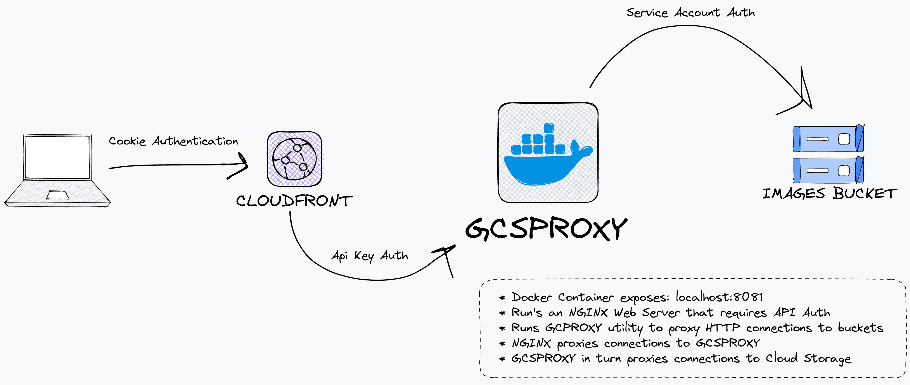

# Riley's GCS Proxy

This document provides instructions for running a docker container with `gcsproxy` and NGINX setup to proxy connections to `gcsproxy`.

## Architecture Diagram

An example of a potential use case for this setup is to proxy connections to a GCS bucket that is not publicly accessible but requires a basic HTTP(S) connection. For example for connecting a Cloudfront Distribution to GCS.

This can be done by running a docker container with `gcsproxy` and NGINX setup to proxy connections to `gcsproxy`. The diagram below shows the architecture of this setup:



## Prerequisites

Before proceeding, ensure that you have the following:

- Docker installed
- GCP project with the necessary permissions to access the required GCS buckets

## Usage

1. Clone/download the repository to your local machine:

```bash
git clone https://github.com/withriley/gcsproxy.git
```

1. Navigate to the cloned/downloaded directory:

```bash
cd gcsproxy
```

1. Build the docker container:

```bash
docker build -t gcsproxy .
```

1. Run the docker container:

```bash
docker run \
-v "$HOME/.config/gcloud/application_default_credentials.json":/gcp/creds.json:ro \
-p 8081:8081 \
-e GOOGLE_APPLICATION_CREDENTIALS=/gcp/creds.json \
gcsproxy
```

where:

- `"$HOME/.config/gcloud/application_default_credentials.json"` is the path to your GCP credentials file
- `8081` is the port that NGINX will listen on
- `GOOGLE_APPLICATION_CREDENTIALS=/gcp/creds.json` is the environment variable that `gcsproxy` will use to authenticate to GCP
- `gcsproxy` is the name of the docker container

To then connect to the bucket:

```bash
curl -X GET http://localhost:8081/bucket-name/object-name
```

## License

This project is licensed under the MIT License - see the LICENSE file for details.
